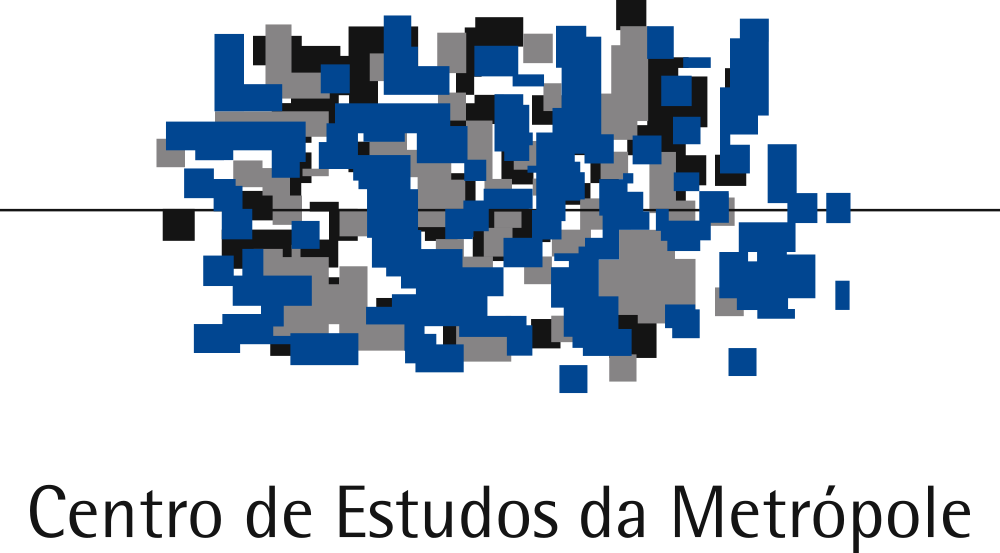

# r-course-exercise

<!-- badges: start -->
[](https://www.repostatus.org/#inactive)
[](https://doi.org/10.5281/zenodo.18615610)
[](https://fairsoftwarechecklist.net/v0.2?f=21&a=32113&i=32300&r=123)
[](https://fair-software.eu)
[](https://www.gnu.org/licenses/gpl-3.0)
[](https://creativecommons.org/licenses/by-nc-sa/4.0/)
[](https://www.contributor-covenant.org/version/3/0/code_of_conduct/)
<!-- badges: end -->

## Overview

This repository contains a data analysis exercise for the course [An Introduction to the R Programming Language](https://danielvartan.github.io/r-course/).

The analysis check for potential differences in ultra-processed food consumption among Brazilian children aged 2 to 4 in 2022 between municipalities in clusters B and D of the Revised Multidimensional Index for Sustainable Food Systems ([MISFS-R](https://doi.org/10.1002/sd.2376)).

The report is available [here](https://danielvartan.github.io/r-course-exercise/).

> [!IMPORTANT]
> **This exercise is for educational purposes only**.
>
> The data used in this exercise requires further cleaning and validation before it can be used in real-world applications. For the purposes of this analysis, the data is assumed to be valid, reliable, and to satisfy all assumptions underlying the statistical tests performed, even though this may not hold in practice.
>
> Please note that **the results of the statistical tests may not be valid** due to these simplifications.
>
> In real-world scenarios, always ensure that the assumptions of statistical tests are rigorously checked and validated before interpreting the results.

## Usage

The pipeline was developed using the [Quarto](https://quarto.org/) publishing system, along with the [R](https://www.r-project.org/) programming language. To ensure consistent results, the [`renv`](https://rstudio.github.io/renv/) package was used to manage and restore the R environment.

After installing the three dependencies mentioned above, follow these steps to reproduce the results:

1. **Clone** this repository to your local machine.
2. **Open** the project in your preferred [IDE](https://en.wikipedia.org/wiki/Integrated_development_environment).
3. **Restore the R environment** by running [`renv::restore()`](https://rstudio.github.io/renv/reference/restore.html) in the R console. This will install all required software dependencies.
4. **Open** `index.qmd` and run the code as described in the report.

## Rendering

After installing all dependencies (see the [Usage](#usage) section), run the following command in the terminal from the project's root directory:

```bash
quarto render
```

This will start the rendering process. Once complete, the [Quarto](https://quarto.org/) document will be available in the [`docs`](docs) folder.

## Contributing

[](https://www.contributor-covenant.org/version/3/0/code_of_conduct/)

Contributions are always welcome! Whether you want to report bugs, suggest new features, or help improve the code or documentation, your input makes a difference.

Before opening a new issue, please check the [issues tab](https://github.com/danielvartan/r-course-exercise/issues) to see if your topic has already been reported.

## Citation

<!-- [](https://doi.org/10.5281/zenodo.18332665) -->

To cite this work, please use the following format:

Vartanian, D. (2026). *An introduction to the R programming language: Class exercise* \[Report\]. Center for Metropolitan Studies, University of São Paulo.

A BibLaTeX entry for LaTeX users is:

```
@report{vartanian2026,
  title = {An introduction to the R programming language: Class exercise},
  author = {{Daniel Vartanian}},
  year = {2026},
  address = {São Paulo},
  institution = {Center for Metropolitan Studies, University of São Paulo},
  langid = {en}
```

## License

[](https://www.gnu.org/licenses/gpl-3.0)
[](https://creativecommons.org/licenses/by-nc-sa/4.0/)

> [!IMPORTANT]
> The original data sources may be subject to their own licensing terms and conditions.

The code in this repository is licensed under the [GNU General Public License Version 3](https://www.gnu.org/licenses/gpl-3.0), while the report is available under the [Creative Commons Attribution-NonCommercial-ShareAlike 4.0 International](https://creativecommons.org/licenses/by-nc-sa/4.0/).

```text
Copyright (C) 2026 Daniel Vartanian

The code in this report is free software: you can redistribute it and/or
modify it under the terms of the GNU General Public License as published by the
Free Software Foundation, either version 3 of the License, or (at your option)
any later version.

This program is distributed in the hope that it will be useful, but WITHOUT ANY
WARRANTY; without even the implied warranty of MERCHANTABILITY or FITNESS FOR A
PARTICULAR PURPOSE. See the GNU General Public License for more details.

You should have received a copy of the GNU General Public License along with
this program. If not, see <https://www.gnu.org/licenses/>.
```

## Acknowledgments

<table>
  <tr>
    <td width="30%" align="center" valign="center">
        <a href="https://centrodametropole.fflch.usp.br"></a>
    </td>
    <td width="70%" valign="center">
      This work was developed with support from the Center for Metropolitan Studies (<a href="https://centrodametropole.fflch.usp.br">CEM</a>) based at the School of Philosophy, Letters and Human Sciences (<a href="https://www.fflch.usp.br/">FFLCH</a>) of the University of São Paulo (<a href="https://usp.br">USP</a>) and at the Brazilian Center for Analysis and Planning (<a href="https://cebrap.org.br/">CEBRAP</a>).
    </td>
  </tr>
</table>

<table>
  <tr>
    <td width="30%" align="center" valign="center">
      <a href="https://fapesp.br/"></a>
    </td>
    <td width="70%" valign="center">
      This work was financed, in part, by the São Paulo Research Foundation (<a href="https://fapesp.br/">FAPESP</a>), Brazil. Process Number <a href="https://bv.fapesp.br/en/bolsas/231507/geospatial-data-science-applied-to-food-policies/">2025/17879-2</a>.
    </td>
  </tr>
</table>

<table>
  <tr>
    <td width="30%" align="center" valign="center">
      <a href="https://www.fsp.usp.br/sustentarea/"></a>
    </td>
    <td width="70%" valign="center">
      This work was developed with support from the <a href="https://www.fsp.usp.br/sustentarea/">Sustentarea</a> Research and Extension Group at the University of São Paulo (<a href="https://usp.br/">USP</a>).
    </td>
  </tr>
</table>

<table>
  <tr>
    <td width="30%" align="center" valign="center">
      <a href="https://www.gov.br/cnpq/"></a>
    </td>
    <td width="70%" valign="center">
      This work was financed, in part, by the National Council for Scientific and Technological Development (<a href="https://www.gov.br/cnpq/">CNPq</a>), Brazil. Process Number 383443/2024-5.
    </td>
  </tr>
</table>
