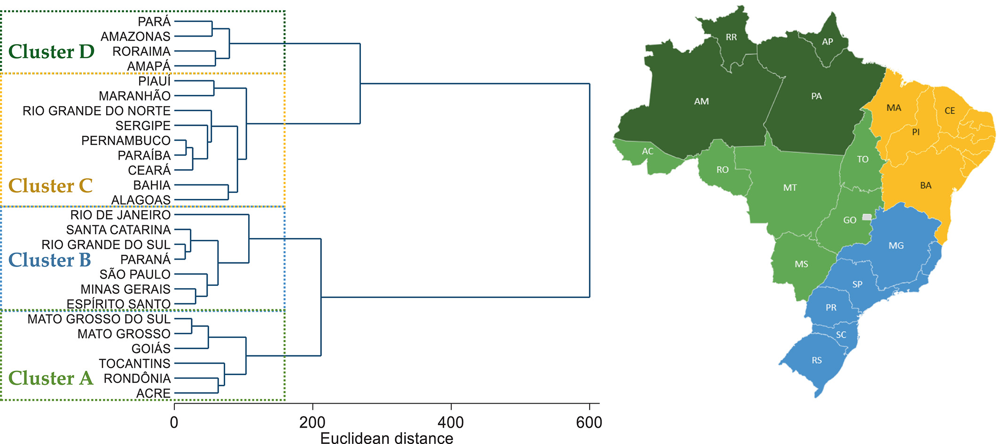
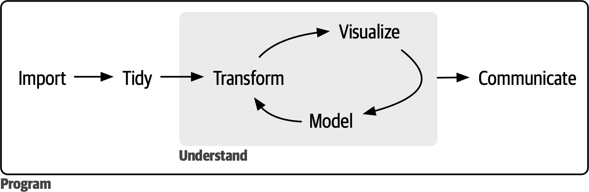

```{r}
#| label: Setup
#| include: false

library(here)

here("R", ".setup.R") |> source()
```

<!-- badges: start -->
[](https://www.repostatus.org/#inactive)
[](https://doi.org/10.5281/zenodo.18615610)
[](https://fairsoftwarechecklist.net/v0.2?f=21&a=32113&i=32300&r=123)
[](https://fair-software.eu)
[](https://www.gnu.org/licenses/gpl-3.0)
[](https://creativecommons.org/licenses/by-nc-sa/4.0/)
[](https://www.contributor-covenant.org/version/3/0/code_of_conduct/)
<!-- badges: end -->

## Overview

This report contains a data analysis exercise for the course [An Introduction to the R Programming Language](https://danielvartan.github.io/r-course/).

The analysis check for potential differences in ultra-processed food consumption among Brazilian children aged 2 to 4 in 2022 between municipalities in clusters B and D of the Revised Multidimensional Index for Sustainable Food Systems ([MISFS-R](https://doi.org/10.1002/sd.2376)).

::: {.callout-warning}
**This exercise is for educational purposes only**.

The data used in this exercise requires further cleaning and validation before it can be used in real-world applications. For the purposes of this analysis, the data is assumed to be valid, reliable, and to satisfy all assumptions underlying the statistical tests performed, even though this may not hold in practice.

Please note that **the results of the statistical tests may not be valid** due to these simplifications.

In real-world scenarios, always ensure that the assumptions of statistical tests are rigorously checked and validated before interpreting the results.
:::

## Problem

Ultra-processed foods ([UPF](https://en.wikipedia.org/wiki/Ultra-processed_food)) are industrial formulations typically high in added sugars, unhealthy fats, and salt, while being low in essential nutrients [@monteiro2018; @monteiro2019]. Their consumption has been linked to various adverse health outcomes, including obesity [@louzada2015], cardiovascular diseases [@mendonca2017], and metabolic disorders [@lavigne-robichaud2018].

Although the consumption of [UPF](https://en.wikipedia.org/wiki/Ultra-processed_food) has been increasing globally, there is limited research on how it varies across different regions and socio-economic contexts, particularly among children. The Revised Multidimensional Index for Sustainable Food Systems ([MISFS-R](https://doi.org/10.1002/sd.2376)) ([@fig-norde-2023-figure-6]) provides a framework for assessing the sustainability of food systems at a subnational level in Brazil, incorporating local behaviors and practices [@carvalho2021a; @norde2023]. Understanding the relationship between MISFS-R clusters and [UPF](https://en.wikipedia.org/wiki/Ultra-processed_food) consumption can inform targeted interventions to promote healthier dietary patterns among children.

::: {#fig-norde-2023-figure-6}
{width=90%}

[Source: Reproduced from @norde2023.]{.legend}

Dendrogram showing hierarchical cluster analysis of Brazilian states based on Revised Multidimensional Index for Sustainable Food Systems ([MISFS-R](https://doi.org/10.1002/sd.2376)) indicators and geographical location.
:::

## Question

This analysis seeks to address the following question:

::: {style="text-align: center; font-size: 1.1em; padding-top: 30px; padding-bottom: 30px;"}
Was there a [**meaningful**]{.brand-triad-blue-red} difference in [**ultra-processed food consumption**]{.brand-triad-blue-red} among Brazilian children aged [**2 to 4**]{.brand-triad-blue-red} in [**2022**]{.brand-triad-blue-red} between municipalities in [**clusters B and D**]{.brand-triad-blue-red} of the Revised Multidimensional Index for Sustainable Food Systems ([MISFS-R](https://doi.org/10.1002/sd.2376))?
:::

## Methods

### Approach

This study employed Popper's [hypothetical-deductive method](https://en.wikipedia.org/wiki/Hypothetico-deductive_model), also known as the method of conjecture and refutation [@popper1979a, p. 164], as its problem-solving approach. Procedurally, it applied an enhanced version of Null Hypothesis Significance Testing ([NHST](https://en.wikipedia.org/wiki/Statistical_hypothesis_test#NHST)), grounded on the original ideas of Neyman-Pearson framework for data testing [@neyman1928; @neyman1928a; @perezgonzalez2015].

### Source of Data

The data used in this analysis were sourced from the Food and Nutrition Surveillance System ([SISVAN](https://sisaps.saude.gov.br/sisvan/)) of the Brazilian Ministry of Health ([MS](https://www.gov.br/saude)) [@sisvana].

### Data Munging

The data munging follow the data science workflow outlined by @wickham2023e. All processes were made using the [Quarto](https://quarto.org/) publishing system [@allaire], the [R](https://www.r-project.org/) programming language [@rcoreteam], and several R packages.

For data manipulation and workflow, priority was given to packages from the [Tidyverse](https://www.tidyverse.org/), [Tidymodels](https://www.tidymodels.org), and [rOpenSci](https://ropensci.org) frameworks, as well as other packages adhering to the tidy tools manifesto [@wickham2023c].

::: {#fig-wickham-at-al-2023-figure-1}
{width=75%}

[Source: Reproduced from @wickham2023e.]{.legend}

Data science workflow proposed by Wickham, Çetinkaya-Runde, and Grolemund.
:::

### Data Analysis

The analysis employed a bilateral [t-test for independent groups](https://en.wikipedia.org/wiki/Student%27s_t-test) with a [randomization-based empirical null distribution](https://infer.netlify.app/articles/t_test#sample-t-test-1). Summary tables and visual inspections were conducted to explore patterns in the data.

Furthermore, an *a priori* power analysis and effect-size estimation were performed to evaluate the statistical robustness and practical significance of the findings.

### Data Validation

Data from municipalities with fewer than 10 monitored children were excluded to ensure reliable estimates. Additionally, municipalities where the number of children consuming ultra-processed foods ([UPF](https://en.wikipedia.org/wiki/Ultra-processed_food)) exceeded the total number of monitored children were removed, as this indicates data inconsistencies.

This does not guarantee the validity of the data, but it helps to mitigate some potential issues.

### Hypothesis Testing

The analysis tested whether the means of ultra-processed food consumption among Brazilian children aged 2 to 4 in 2022 differed meaningfully between municipalities in clusters B and D of the Revised Multidimensional Index for Sustainable Food Systems ([MISFS-R](https://doi.org/10.1002/sd.2376)).

To ensure practical significance, a Minimum Effect Size ([MES](https://en.wikipedia.org/wiki/Effect_size)) criterion was applied, following the original Neyman-Pearson framework for hypothesis testing [@neyman1928; @neyman1928a; @perezgonzalez2015]. The MES was set at Cohen's threshold for small effects (Cohen's $d$ = 0.2) [@cohen1988a]. A difference was considered meaningful only if its effect size was greater than or equal to the MES; otherwise, it was considered negligible.

The test was structured as follows:

- **Null Hypothesis** ($\text{H}_{0}$): Ultra-processed food consumption among Brazilian children aged 2 to 4 in 2022 does not differ meaningfully between municipalities in MISFS-R clusters B and D, indicated by Cohen's $d$ effect-size statistic being smaller than 0.2 (negligible).

- **Alternative Hypothesis** ($\text{H}_{a}$): Ultra-processed food consumption among Brazilian children aged 2 to 4 in 2022 differs meaningfully between municipalities in MISFS-R clusters B and D, indicated by Cohen's $d$ effect-size statistic being greater or equal than 0.2 (non-negligible).

Formally:

$$
\begin{cases}
\text{H}_{0}: \mu_{A} = \mu_{B} \\
\text{H}_{a}: \mu_{A} \neq \mu_{B} \\
\end{cases}
$$

$$
\begin{cases}
\text{H}_{0}: \text{Cohen's d} < \text{MES} \\
\text{H}_{a}: \text{Cohen's d} \geq \text{MES} \\
\end{cases}
$$

The hypothesis test is conditioned on a [Type I error](https://en.wikipedia.org/wiki/Type_I_and_type_II_errors) ($\alpha$) of 0.05 and a minimum [statistical power](https://en.wikipedia.org/wiki/Power_(statistics)) (1 - $\beta$) of 0.8. This means the test should have at least an 80% probability of correctly rejecting the null hypothesis when it is false, thereby minimizing the risk of a [Type II error](https://en.wikipedia.org/wiki/Type_I_and_type_II_errors) ($\beta$).

### Code Style

The Tidyverse [tidy tools manifesto](https://tidyverse.tidyverse.org/articles/manifesto.html) [@wickham2023e], [code style guide](https://style.tidyverse.org/) [@wickhama] and [design principles](https://design.tidyverse.org/) [@wickhamc] were followed to ensure consistency and enhance readability.

### Reproducibility

The pipeline is fully reproducible and can be run again at any time. To ensure consistent results, the [`renv`](https://rstudio.github.io/renv/) package [@ushey2025] was used to manage and restore the R environment. See the [README](https://github.com/danielvartan/r-course-exercise/blob/main/README.md) file in the code repository to learn how to run it.

## Set the Environment

### Load Packages

```{r}
#| label: Set the Environment
#| output: false

library(brandr)
library(dplyr)
library(effectsize)
library(forcats)
library(fs)
library(ggplot2)
library(gt)
library(here)
library(htmltools)
library(httr2)
library(infer)
library(janitor)
library(labelled)
library(magrittr)
library(nanoparquet)
library(patchwork)
library(pwr)
library(pwrss)
library(readr)
library(readxl)
library(stringr)
library(summarytools)
library(tidyr)
```

### Set Data Directories

```{r}
raw_data_dir <- here("data-raw")
data_dir <- here("data")
```

```{r}
for (i in c(raw_data_dir, data_dir)) {
  if (!dir.exists(i)) {
    dir.create(i)
  }
}
```

## Perform an *a priori* Power Analysis

```{r}
#| label: Power Analysis a priori

pwr_analysis <- pwr.t.test(
  d = 0.2,
  sig.level = 0.05,
  power = 0.8,
  type = "two.sample",
  alternative = "two.sided"
)
```

```{r}
pwr_analysis
```

```{r}
#| code-fold: true

pwr_analysis <- pwrss.t.2means(
  mu1 = 0.2, # Cohen's d for small effect sizes
  mu2 = 0,
  power = 0.8,
  alpha = 0.05,
  welch.df = TRUE,
  alternative = "not equal"
)

power.t.test(
  ncp = pwr_analysis$ncp,
  df = pwr_analysis$df,
  alpha = pwr_analysis$parms$alpha,
  alternative = "two.sided",
  plot = TRUE,
  verbose = FALSE
)
```

## Download Data

```{r}
#| label: Download Data
#| eval: false
#| output: false

request("https://sisaps.saude.gov.br") |>
  req_url_path_append("sisvan") |>
  req_url_path_append("public") |>
  req_url_path_append("file") |>
  req_url_path_append("relatorios") |>
  req_url_path_append("consumo") |>
  req_url_path_append("2oumais") |>
  req_url_path_append("entre2a4anos") |>
  req_url_path_append("CONS_ULTRA.xlsx") |>
  req_perform(
    path = here(raw_data_dir, "CONS_ULTRA.xlsx")
  )
```

## Import Data

```{r}
#| label: Import Data
#| output: false

data <-
  here(raw_data_dir, "CONS_ULTRA.xlsx") |>
  read_xlsx(
    sheet = "2022",
    skip = 1,
    col_types = "text"
  )
```

```{r}
data |> glimpse()
```

## Tidy Data

### Rename Columns

```{r}
#| label: Tidy Data

data <-
  data |>
  clean_names() |>
  rename(
    municipality_code = codigo_ibge,
    municipality = municipio,
    federal_unit = uf,
    n_upf = total,
    n_upf_per = percent,
    n_monitored = x6
  )
```

```{r}
data |> glimpse()
```

### Standardize Columns

```{r}
data <-
  data |>
  mutate(
    year = 2022 |> as.integer(),
    municipality_code = municipality_code |> as.integer(),
    federal_unit = federal_unit |> as.factor(),
    n_upf = n_upf |> as.integer(),
    n_monitored = n_monitored |> as.integer()
  )
```

```{r}
data |> glimpse()
```

### Relocate Columns

```{r}
data <-
  data |>
  relocate(year) |>
  relocate(federal_unit, .after = municipality)
```

```{r}
data |> glimpse()
```

## Validate Data

### Filter Data

```{r}
data <-
  data |>
  filter(
    !(n_upf > n_monitored),
    !(n_upf < 10)
  )
```

```{r}
data |> glimpse()
```

## Transform Data

### Recalculate UPF Consumption Percentage

```{r}
data <-
  data |>
  mutate(
    n_upf_per = n_upf |>
      divide_by(n_monitored) |>
      multiply_by(100)
  )
```

```{r}
data |> glimpse()
```

### Define MISFS

```{r}
data <-
  data |>
  mutate(
    misfs = federal_unit |>
      recode_values(
        c("AC", "GO", "MS", "MT", "RO", "TO") ~ "A",
        c("ES", "MG", "PR", "RJ", "RS", "SC", "SP") ~ "B",
        c("AL", "BA", "CE", "MA", "PB", "PE", "PI", "RN", "SE") ~ "C",
        c("AM", "AP", "PA", "RR") ~ "D"
      ) |>
      factor(levels = c("A", "B", "C", "D"))
  ) |>
  relocate(misfs, .after = federal_unit)
```

```{r}
data |> glimpse()
```

### Filter MISFS

```{r}
data <-
  data |>
  filter(misfs %in% c("B", "D"))
```

```{r}
data |> glimpse()
```

## Create Data Dictionary

### Prepare Metadata

```{r}
#| label: Create Data Dictionary

metadata <-
  data |>
  `var_label<-`(
    list(
      year = "Year of the data collection",
      municipality_code = "Municipality code",
      municipality = "Municipality name",
      federal_unit = "State abbreviation (Federal Unit)",
      misfs = paste0(
        "Revised Multidimensional Index for Sustainable Food Systems (MISFS-R)",
        "cluster"
      ),
      n_upf = "Number of children that consumed ultra-processed foods (UPF)",
      n_upf_per = paste0(
        "Percentage of children that consumed ultra-processed foods (UPF)"
      ),
      n_monitored = "Number of monitored children"
    )
  ) |>
  generate_dictionary(details = "full") |>
  convert_list_columns_to_character()
```

### Visualize Final Data

```{r}
metadata |> glimpse()
```

```{r}
metadata
```

```{r}
data |> glimpse()
```

```{r}
data
```

## Save Data

### Clean Old Data Files

```{r}
#| label: Save Data

if (dir.exists(data_dir)) {
  dir_delete(data_dir)
  dir_create(data_dir, recurse = TRUE)
}
```

### Write Data

```{r}
valid_file_pattern <- "sisvan-upf-2022"
```

```{r}
#| output: false

data |>
  write_csv(
    here(data_dir, paste0(valid_file_pattern, ".csv"))
  )
```

```{r}
#| output: false

data |>
  write_rds(
    here(data_dir, paste0(valid_file_pattern, ".rds"))
  )
```

```{r}
#| output: false

data |>
  write_parquet(
    here(data_dir, paste0(valid_file_pattern, ".parquet"))
  )
```

## Explore Data

### Visualize a Random Sample of the Data

```{r}
#| label: Explore Data
#| code-fold: true

data |> sample_n(100)
```

### Visualize Distributions

:::: {.panel-tabset}
#### `n_upf_per`

::: {#tbl-var-distribution-freqs-n_upf}
```{r}
#| code-fold: true
#| output: asis

data |>
  descr(
    var = n_upf_per,
    style = "rmarkdown",
    plain.ascii = FALSE,
    headings = FALSE
  )
```

[Source: Created by the author based on data sourced from the Food and Nutrition Surveillance System ([SISVAN](https://sisaps.saude.gov.br/sisvan/)) of the Brazilian Ministry of Health ([MS](https://www.gov.br/saude)) [@sisvana].]{.legend}

Descriptive statistics representing the distribution of the percentage of children aged 2 to 4 in 2022 who consumed ultra-processed foods ([UPF](https://en.wikipedia.org/wiki/Ultra-processed_food)) between municipalities in clusters B and D of the Revised Multidimensional Index for Sustainable Food Systems ([MISFS-R](https://doi.org/10.1002/sd.2376)).
:::

::: {#fig-var-distribution-hist-qq-plot-n_upf}
```{r}
#| code-fold: true

plot_hist <-
  data |>
  ggplot(aes(x = n_upf_per)) +
  geom_histogram(
    aes(y = after_stat(density)),
    bins = 30,
    color = "white"
  ) +
  labs(x = "Value", y = "Density") +
  geom_density(
    color = "red",
    linewidth = 1
  ) +
  theme(legend.position = "none")

plot_qq <-
  data |>
  ggplot(aes(sample = n_upf_per)) +
  stat_qq() +
  stat_qq_line(
    color = "red",
    linewidth = 1
  ) +
  labs(
    x = "Theoretical Quantiles (Std. Normal)",
    y = "Sample Quantiles"
  ) +
  theme(legend.position = "none")

plot_hist + plot_qq
```

[Source: Created by the author based on data sourced from the Food and Nutrition Surveillance System ([SISVAN](https://sisaps.saude.gov.br/sisvan/)) of the Brazilian Ministry of Health ([MS](https://www.gov.br/saude)) [@sisvana].]{.legend}

Histogram with density curve and Q-Q plot showing the distribution of the percentage of children aged 2 to 4 in 2022 who consumed ultra-processed foods ([UPF](https://en.wikipedia.org/wiki/Ultra-processed_food)) between municipalities in clusters B and D of the Revised Multidimensional Index for Sustainable Food Systems ([MISFS-R](https://doi.org/10.1002/sd.2376)).
:::

::: {#fig-var-distribution-boxplot-n_upf}
```{r}
#| code-fold: true

data |>
  select(n_upf_per) |>
  pivot_longer(everything()) |>
  ggplot(aes(x = name, y = value)) +
  geom_boxplot(
    outlier.color = "red",
    outlier.shape = 1,
    width = 0.75
  ) +
  geom_jitter(
    width = 0.375,
    alpha = 0.1,
    color = get_brand_color("black"),
    size = 0.5
  ) +
  coord_flip() +
  scale_fill_brand_d() +
  labs(y = "Value") +
  theme(
    axis.title.y = element_blank(),
    axis.text.y = element_blank(),
    axis.ticks.y = element_blank()
  )
```

[Source: Created by the author based on data sourced from the Food and Nutrition Surveillance System ([SISVAN](https://sisaps.saude.gov.br/sisvan/)) of the Brazilian Ministry of Health ([MS](https://www.gov.br/saude)) [@sisvana].]{.legend}

Boxplot with jitter points showing the distribution of the percentage of children aged 2 to 4 in 2022 who consumed ultra-processed foods ([UPF](https://en.wikipedia.org/wiki/Ultra-processed_food)) in clusters B and D of the Revised Multidimensional Index for Sustainable Food Systems ([MISFS-R](https://doi.org/10.1002/sd.2376)).
:::

#### `misfs`

::: {#tbl-var-distribution-freqs-misfs}
```{r}
#| code-fold: true
#| output: asis

data |>
  freq(
    var = misfs,
    style = "rmarkdown",
    plain.ascii = FALSE,
    headings = FALSE
  )
```

[Source: Created by the author based on data sourced from the Food and Nutrition Surveillance System ([SISVAN](https://sisaps.saude.gov.br/sisvan/)) of the Brazilian Ministry of Health ([MS](https://www.gov.br/saude)) [@sisvana].]{.legend}

Frequencies representing the distribution of observations for children aged 2 to 4 in 2022 who consumed ultra-processed foods ([UPF](https://en.wikipedia.org/wiki/Ultra-processed_food)) between municipalities in clusters B and D of the Revised Multidimensional Index for Sustainable Food Systems ([MISFS-R](https://doi.org/10.1002/sd.2376)).
:::

::: {#fig-var-distribution-bar-plot-misfs}
```{r}
#| code-fold: true

data |>
  mutate(
    misfs = misfs |> fct_rev()
  ) |>
  ggplot(aes(y = misfs)) +
  geom_bar(fill = get_brand_color("blue")) +
  scale_y_discrete(drop = FALSE) +
  labs(
    x = "MISFS-R Cluster",
    y = "Frequency"
  )
```

[Source: Created by the author based on data sourced from the Food and Nutrition Surveillance System ([SISVAN](https://sisaps.saude.gov.br/sisvan/)) of the Brazilian Ministry of Health ([MS](https://www.gov.br/saude)) [@sisvana].]{.legend}

Bar plot showing the frequency of observations for children aged 2 to 4 in 2022 who consumed ultra-processed foods ([UPF](https://en.wikipedia.org/wiki/Ultra-processed_food)) between municipalities in clusters B and D of the Revised Multidimensional Index for Sustainable Food Systems ([MISFS-R](https://doi.org/10.1002/sd.2376)).
:::
::::

### Visualize Combined Distributions

::: {#fig-combine-distributions-boxplot}
```{r}
#| code-fold: true

data |>
  ggplot(
    aes(
      x = misfs,
      y = n_upf_per,
      fill = misfs
    )
  ) +
  geom_boxplot(
    outlier.color = "red"
  ) +
  geom_jitter(
    width = 0.375,
    alpha = 0.1,
    color = "black",
    size = 0.5
  ) +
  scale_fill_brand_d() +
  labs(
    x = "MISFS-R Cluster",
    y = "UPF consumption (%)",
    fill = NULL
  )
```

[Source: Created by the author based on data sourced from the Food and Nutrition Surveillance System ([SISVAN](https://sisaps.saude.gov.br/sisvan/)) of the Brazilian Ministry of Health ([MS](https://www.gov.br/saude)) [@sisvana].]{.legend}

Boxplots with jitter points showing the distribution of the percentage of children aged 2 to 4 in 2022 who consumed ultra-processed foods ([UPF](https://en.wikipedia.org/wiki/Ultra-processed_food)) between municipalities in clusters B and D of the Revised Multidimensional Index for Sustainable Food Systems ([MISFS-R](https://doi.org/10.1002/sd.2376)).
:::

::: {#fig-combine-distributions-density-plot}
```{r}
#| code-fold: true

data |>
  ggplot(
    aes(
      x = n_upf_per,
      fill = misfs
    )
  ) +
  geom_density(
    alpha = 0.5,
    position = "identity"
  ) +
  scale_fill_brand_d() +
  labs(
    x = "UPF consumption (%)",
    y = "Density",
    fill = "MISFS"
  )
```

[Source: Created by the author based on data sourced from the Food and Nutrition Surveillance System ([SISVAN](https://sisaps.saude.gov.br/sisvan/)) of the Brazilian Ministry of Health ([MS](https://www.gov.br/saude)) [@sisvana].]{.legend}

Density plots showing the distribution of the percentage of children aged 2 to 4 in 2022 who consumed ultra-processed foods ([UPF](https://en.wikipedia.org/wiki/Ultra-processed_food)) between municipalities in clusters B and D of the Revised Multidimensional Index for Sustainable Food Systems ([MISFS-R](https://doi.org/10.1002/sd.2376)).
:::

::: {#fig-combine-distributions-density-plot}
```{r}
#| code-fold: true

data |>
  ggplot(
    aes(
      sample = n_upf_per,
      color = misfs
    )
  ) +
  stat_qq() +
  stat_qq_line(color = "black") +
  scale_color_brand_d() +
  facet_wrap(vars(misfs)) +
  labs(
    x = "Theoretical Quantiles (Std. Normal)",
    y = "Sample Quantiles",
    color = "MISFS"
  )
```

[Source: Created by the author based on data sourced from the Food and Nutrition Surveillance System ([SISVAN](https://sisaps.saude.gov.br/sisvan/)) of the Brazilian Ministry of Health ([MS](https://www.gov.br/saude)) [@sisvana].]{.legend}

Q-Q plots showing the distribution of the percentage of children aged 2 to 4 in 2022 who consumed ultra-processed foods ([UPF](https://en.wikipedia.org/wiki/Ultra-processed_food)) between municipalities in clusters B and D of the Revised Multidimensional Index for Sustainable Food Systems ([MISFS-R](https://doi.org/10.1002/sd.2376)).
:::

### Summarize Data

::: {#tbl-var-distribution-summary-misfs}
```{r}
#| code-fold: true

data |>
  group_by(misfs) |>
  summarize(
    n = n(),
    mean = mean(n_upf_per) / 100,
    sd = sd(n_upf_per) / 100,
    median = median(n_upf_per) / 100,
    iqr = IQR(n_upf_per) / 100
  ) |>
  pivot_longer(
    cols = -misfs,
    names_to = "Statistic",
    values_to = "Value"
  ) |>
  pivot_wider(
    names_from = misfs,
    values_from = Value
  ) |>
  mutate(
    Statistic = Statistic |>
      recode_values(
        "n" ~ "Sample Size",
        "mean" ~ "Mean",
        "sd" ~ "Standard Deviation",
        "median" ~ "Median",
        "iqr" ~ "Interquartile Range"
      )
  ) |>
  gt() |>
  tab_header(
    title = md("**Children Aged 2 to 4 UPF Consumption**"),
    subtitle = "Comparison between MISFS-R Clusters B and D in 2022"
  ) |>
  cols_label(
    Statistic = "",
    B = "Cluster B",
    D = "Cluster D"
  ) |>
  fmt_percent(
    columns = c(B, D),
    rows = !Statistic %in% c("Sample Size"),
    decimals = 2
  ) |>
  tab_footnote(
    footnote = paste0(
      "Statistics calculated removing municipalities with fewer than 10 ",
      "monitored children and those where the number of children consuming ",
      "UPFs exceeded the total number of monitored children."
    ),
    locations = cells_body(
      columns = Statistic,
      rows = !Statistic %in% c("Sample Size")
    ),
    placement = "right"
  ) |>
  opt_footnote_marks(marks = c("*", "+")) |>
  # tab_source_note(
  #   source_note = "Source: SISVAN, Brazilian Ministry of Health (2022)"
  # ) |>
  tab_options(
    table.width = pct(75),
    table.border.top.style = "solid",
    table.border.bottom.style = "solid",
    heading.border.bottom.style = "solid",
    column_labels.border.bottom.style = "solid",
    row_group.border.top.style = "solid",
    row_group.border.bottom.style = "solid",
    footnotes.border.lr.style = "solid",
    source_notes.border.bottom.style = "solid"
  ) |>
  opt_css(
    css = "
    .gt_footnote {
      text-align: left !important;
    }
    "
  )
```

[Source: Created by the author based on data sourced from the Food and Nutrition Surveillance System ([SISVAN](https://sisaps.saude.gov.br/sisvan/)) of the Brazilian Ministry of Health ([MS](https://www.gov.br/saude)) [@sisvana].]{.legend}

Percentage of children aged 2 to 4 in 2022 who consumed ultra-processed foods ([UPF](https://en.wikipedia.org/wiki/Ultra-processed_food)) between municipalities in clusters B and D of the Revised Multidimensional Index for Sustainable Food Systems ([MISFS-R](https://doi.org/10.1002/sd.2376)).
:::

## Assess Model Assumptions

::: {.callout-tip}
See @howell2013 and @student1908 to learn more about the assumptions of the [t-test](https://en.wikipedia.org/wiki/Student%27s_t-test).
:::

✅ Independence of observations.

❌ Normality of the distribution of the response variable (`n_upf_per`) within each group (`misfs` is the explanatory/independent variable).

⏭️ Homogeneity of variances between groups (only if using Student's t-test; [Welch's t-test](https://en.wikipedia.org/wiki/Welch%27s_t-test) and the permutation approach below do not require this assumption).

## Model Data

### Calculate Observed Statistic

```{r}
#| label: Model Data
#| output: false

observed_statistic <-
  data |>
  specify(n_upf_per ~ misfs) |>
  hypothesize(null = "independence") |>
  calculate(
    stat = "t",
    order = c("B", "D")
  )
```

```{r}
observed_statistic
```

### Generate the Null Distribution

```{r}
#| output: false

null_dist <-
  data |>
  specify(n_upf_per ~ misfs) |>
  hypothesize(null = "independence") |>
  generate(
    reps = 1000,
    type = "permute"
  ) |>
  calculate(
    stat = "t",
    order = c("B", "D")
  )
```

```{r}
null_dist |>
  visualize() +
  shade_p_value(
    obs_stat = observed_statistic,
    direction = "two-sided"
  ) +
  labs(
    title = NULL,
    x = "t-statistic",
    y = "Frequency"
  )
```

### Assess p-value

```{r}
p_value <-
  null_dist |>
  get_p_value(
    obs_stat = observed_statistic,
    direction = "two-sided"
  )
```

```{r}
p_value
```

### Assess Effect Size

```{r}
misfs_b <-
  data |>
  filter(misfs == "B") |>
  pull(n_upf_per)
```

```{r}
misfs_d <-
  data |>
  filter(misfs == "D") |>
  pull(n_upf_per)
```

```{r}
cohens_d(
  x = misfs_b,
  y = misfs_d,
  mu = 0,
  ci = 0.95,
  alternative = "two.sided"
) |>
  interpret_hedges_g(rules = "cohen1988")
```

## Conclusion

As noted at the beginning of this exercise, the data and analysis are purely educational and should not be used to draw real-world conclusions without further validation. **The data contain numerous issues and do not meet the assumptions of the statistical tests used**, which compromise the reliability of the results. Therefore, any conclusions should be interpreted with caution.

Assuming the data were valid and the t-test assumptions were met, the analysis found no statistically significant difference in means ($t$ = 0.899, $p$-value = `{r} p_value$p_value |> round(3)`). The observed effect size was very small and did not exceed the Minimum Effect Size ([MES](https://en.wikipedia.org/wiki/Effect_size)) threshold (Cohen's $d$ = 0.080, 95% CI [-0.107, 0.268]), indicating any potential difference is likely negligible or effectively zero within the 95% confidence interval bounds.

The power analysis revealed that the study lacked sufficient power to detect a small effect size (Cohen's $d$ = 0.2) with the given sample size, which may contribute to the non-significant result. While we cannot reject the null hypothesis, we also cannot confidently conclude that there is no meaningful difference in ultra-processed food consumption between the two clusters.

Based on these findings, we conclude that the [**evidence is insufficient**]{.brand-triad-blue-red} to support a meaningful difference in ultra-processed food consumption among Brazilian children aged 2 to 4 in 2022 between municipalities in clusters B and D. This does not confirm the absence of a difference, only that the study lacked sufficient power to detect one. Future research with a larger sample size may help clarify this relationship.

## Citation

To cite this work, please use the following format:

Vartanian, D. (2026). *An introduction to the R programming language: Class exercise* \[Report\]. Center for Metropolitan Studies, University of São Paulo.

A BibLaTeX entry for LaTeX users is:

```
@report{vartanian2026,
  title = {An introduction to the R programming language: Class exercise},
  author = {{Daniel Vartanian}},
  year = {2026},
  address = {São Paulo},
  institution = {Center for Metropolitan Studies, University of São Paulo},
  langid = {en}
```

## License

::: {style="text-align: left;"}
[](https://www.gnu.org/licenses/gpl-3.0)
[](https://creativecommons.org/licenses/by-nc-sa/4.0/)
:::

::: {.callout-important}
The original data sources may be subject to their own licensing terms and conditions.
:::

The code in this report is licensed under the [GNU General Public License Version 3](https://www.gnu.org/licenses/gpl-3.0), while the report is available under the [Creative Commons Attribution-NonCommercial-ShareAlike 4.0 International](https://creativecommons.org/licenses/by-nc-sa/4.0/).

```text
Copyright (C) 2026 Daniel Vartanian

The code in this report is free software: you can redistribute it and/or
modify it under the terms of the GNU General Public License as published by the
Free Software Foundation, either version 3 of the License, or (at your option)
any later version.

This program is distributed in the hope that it will be useful, but WITHOUT ANY
WARRANTY; without even the implied warranty of MERCHANTABILITY or FITNESS FOR A
PARTICULAR PURPOSE. See the GNU General Public License for more details.

You should have received a copy of the GNU General Public License along with
this program. If not, see <https://www.gnu.org/licenses/>.
```

## Acknowledgments

```{r, results='asis'}
#| eval: true
#| echo: false

blocks <- list(
  list(
    logo_link = "https://centrodametropole.fflch.usp.br",
    logo_src = "images/cem-logo.svg",
    logo_alt = "CEM Logo",
    logo_max_width = 190,
    text = 'This work was developed with support from the Center for Metropolitan Studies (<a href="https://centrodametropole.fflch.usp.br">CEM</a>) based at the School of Philosophy, Letters and Human Sciences (<a href="https://www.fflch.usp.br/">FFLCH</a>) of the University of São Paulo (<a href="https://usp.br">USP</a>) and at the Brazilian Center for Analysis and Planning (<a href="https://cebrap.org.br/">CEBRAP</a>).'
  ),
  list(
    logo_link = "https://fapesp.br",
    logo_src = "images/fapesp-logo.svg",
    logo_alt = "FAPESP Logo",
    logo_max_width = 160,
    text = 'This work was financed, in part, by the São Paulo Research Foundation (<a href="https://fapesp.br/">FAPESP</a>), Brazil. Process Number <a href="https://bv.fapesp.br/en/bolsas/231507/geospatial-data-science-applied-to-food-policies/">2025/17879-2</a>.'
  ),
  list(
    logo_link = "https://www.fsp.usp.br/sustentarea/",
    logo_src = "images/sustentarea-logo.svg",
    logo_alt = "Sustentarea Logo",
    logo_max_width = 110,
    text = 'This work was developed with support from the <a href="https://www.fsp.usp.br/sustentarea/">Sustentarea</a> Research and Extension Group at the University of São Paulo (<a href="https://usp.br/">USP</a>).'
  ),
  list(
    logo_link = "https://www.gov.br/cnpq/",
    logo_src = "images/cnpq-logo.svg",
    logo_alt = "CNPQ Logo",
    logo_max_width = 160,
    text = 'This work was financed, in part, by the National Council for Scientific and Technological Development (<a href="https://www.gov.br/cnpq/">CNPq</a>), Brazil. Process Number 383443/2024-5.'
  )
)

blocks |>
  lapply(
    function(x) {
      div(
        style = paste0(
          "display: flex; ",
          "align-items: center; ",
          "margin-bottom: 2em;"
        ),
        div(
          style = paste0(
            "flex: 0 0 30%; ",
            "display: flex; ",
            "justify-content: center; ",
            "margin: auto 0;"
          ),
          tags$a(
            href = x$logo_link,
            tags$img(
              src = x$logo_src,
              alt = x$logo_alt,
              style = paste0(
                "max-width: ",
                x$logo_max_width,
                "px; ",
                "width: 100%; ",
                "height: auto;"
              )
            )
          )
        ),
        div(
          style = paste0(
            "flex: 1; ",
            "padding-left: 1em;"
          ),
          HTML(x$text)
        )
      )
    }
  ) |>
  tagList() |>
  browsable()
```

## References {.unnumbered}

::: {#refs}
:::
